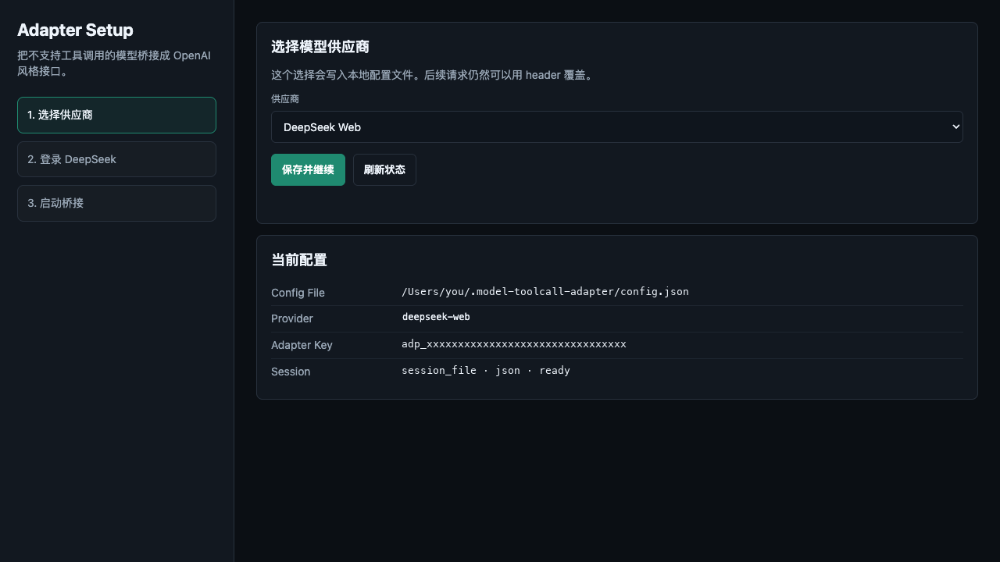

# model-toolcall-adapter-rs

把不原生支持工具调用的模型，桥接成 Codex、OpenAI SDK、Anthropic 风格客户端能使用的标准工具调用接口。

`v0.2.0` · Rust 2021 · 本地优先 · Responses / Chat Completions / Messages · DeepSeek Web

[English](README.md) · [下载 v0.2.0](https://github.com/openaeon/model-toolcall-adapter-rs/releases/tag/v0.2.0) · [架构说明](docs/ARCHITECTURE.zh-CN.md)

## 它解决什么问题

很多模型会推理、会写代码、会判断什么时候需要工具，但它们不一定稳定支持 OpenAI 标准 `tools`、`function_call` 或 `tool_calls`。

这个项目只做一件事：

```text
标准 tools 请求
  -> 转成普通模型能理解的文本工具协议
  -> 发给上游模型
  -> 解析模型输出的工具意图
  -> 返回标准 function_call / tool_calls / Responses output
```

它不执行用户工具，不替代 Codex 或 agent runtime。真实工具仍由 Codex、桌面客户端、后端服务或你自己的 runtime 执行。

## 先下载哪个文件

进入 Release 页面后，不要下载 GitHub 自动生成的 `Source code`。那些只是源码快照，不是可执行程序。

| 系统 | 下载文件 | 适用场景 |
| --- | --- | --- |
| Windows x64 | `model-toolcall-adapter-rs-v0.2.0-windows-x64-exe.zip` | Windows 桌面或服务器 |
| macOS Apple Silicon | `model-toolcall-adapter-rs-v0.2.0-macos-arm64.tar.gz` | M1 / M2 / M3 / M4 Mac |
| Linux x64 | `model-toolcall-adapter-rs-v0.2.0-linux-x64-server.tar.gz` | 常见 x86_64 Linux 服务器 |
| Linux ARM64 | `model-toolcall-adapter-rs-v0.2.0-linux-arm64-server.tar.gz` | ARM64 Linux 服务器 |
| 校验文件 | `SHA256SUMS.txt` | 校验下载包完整性 |

Release 地址：

```text
https://github.com/openaeon/model-toolcall-adapter-rs/releases/tag/v0.2.0
```

## 三步跑起来

### 1. 启动服务

Windows PowerShell：

```powershell
Expand-Archive .\model-toolcall-adapter-rs-v0.2.0-windows-x64-exe.zip
cd .\model-toolcall-adapter-rs-windows-x64
.\model-toolcall-adapter-rs.exe
```

Windows CMD：

```bat
cd model-toolcall-adapter-rs-windows-x64
model-toolcall-adapter-rs.exe
```

macOS：

```bash
tar -xzf model-toolcall-adapter-rs-v0.2.0-macos-arm64.tar.gz
cd model-toolcall-adapter-rs-macos-arm64
chmod +x ./model-toolcall-adapter-rs
./model-toolcall-adapter-rs
```

Linux x64：

```bash
tar -xzf model-toolcall-adapter-rs-v0.2.0-linux-x64-server.tar.gz
cd model-toolcall-adapter-rs-linux-x64
chmod +x ./model-toolcall-adapter-rs
./model-toolcall-adapter-rs
```

Linux ARM64：

```bash
tar -xzf model-toolcall-adapter-rs-v0.2.0-linux-arm64-server.tar.gz
cd model-toolcall-adapter-rs-linux-arm64
chmod +x ./model-toolcall-adapter-rs
./model-toolcall-adapter-rs
```

端口被占用时：

```bash
ADAPTER_BIND=127.0.0.1:8899 ./model-toolcall-adapter-rs
```

### 2. 打开启动向导

浏览器打开：

```text
http://127.0.0.1:8787/ui
```

首次启动会创建：

```text
~/.model-toolcall-adapter/config.json
```

里面会自动生成 `adapter_api_key`，用于保护本地接口。

### 3. 选择上游并复制配置

启动向导按三步走：

1. 选择 provider：`openai-compatible` 或 `deepseek-web`。
2. 如果选择 DeepSeek Web，启动受控浏览器并登录。
3. 捕获 session 后，复制 Base URL、Adapter Key、模型名，或一键写入 Codex 配置。

## 界面预览



## 能力地图

| 能力 | 当前支持 | 说明 |
| --- | --- | --- |
| 外部接口 | Responses / Chat Completions / Messages | 对齐 Codex、OpenAI-compatible 客户端和 Anthropic 风格请求 |
| 工具调用 | XML / JSON / 容错文本解析 | 只产出标准工具调用，不执行工具 |
| Responses 状态 | retrieve / delete / input_items / input_tokens / cancel / compact | 支持 `previous_response_id` 和 Conversations |
| Streaming | Responses SSE | Chat / Messages 暂未做真实增量 |
| 长任务 | `background: true` | 支持轮询 retrieve 和 cancel |
| Structured output | `json_object` / 常见 `json_schema` | 不是完整 JSON Schema 引擎 |
| Reasoning | reasoning/text 分离 | `reasoning.encrypted_content` 是本地 opaque 占位或透传 |
| DeepSeek Web | 登录、session、PoW、SSE、上传 | 支持搜索、思考、专家、识图和文件通道映射 |
| Codex | 一键配置 | 备份并写入 `~/.codex/config.toml` 和 `auth.json` |
| 本地状态 | JSON + lock + 原子替换 | 降低异常退出或多进程写入造成的损坏风险 |

## 适合与不适合

| 适合 | 不适合 |
| --- | --- |
| 上游模型会推理，但不稳定支持 function calling | 让 adapter 直接执行 shell、浏览器、数据库或业务函数 |
| 把 DeepSeek Web、Ollama、vLLM、LM Studio 接入 Codex 风格客户端 | 替代 OpenAI 托管 `file_search` 或 vector store |
| 客户端已经会传 OpenAI `tools`，上游只能返回普通文本 | 完全等价实现 OpenAI 服务端 Structured Outputs |
| 同时暴露 Responses、Chat Completions、Messages 三种入口 | 多个远程服务节点共享同一套 response 状态 |

## 接入 Codex

启动向导第三步可以一键写入 Codex 配置。写入前会备份：

```text
~/.codex/config.toml
~/.codex/auth.json
```

核心配置类似：

```toml
model_provider = "ModelToolCallAdapter"

[model_providers.ModelToolCallAdapter]
name = "ModelToolCallAdapter"
base_url = "http://127.0.0.1:8787/v1"
wire_api = "responses"
requires_openai_auth = true
```

`auth.json`：

```json
{
  "OPENAI_API_KEY": "adp_xxx"
}
```

Codex 已经运行时，配置后需要重启 Codex。

## Provider 配置

### OpenAI-compatible

适用于 Ollama、vLLM、LM Studio、llama.cpp server 和兼容 OpenAI Chat Completions 的自建服务。

```bash
ADAPTER_UPSTREAM_BASE_URL=http://127.0.0.1:11434/v1 \
ADAPTER_UPSTREAM_MODEL=qwen3-coder \
cargo run
```

模型别名：

```bash
ADAPTER_MODEL_ALIASES=gpt-5-codex=qwen3-coder,gpt-5-mini=qwen3-fast cargo run
```

客户端请求 `gpt-5-codex` 时，adapter 会转发到 `qwen3-coder`，响应里再恢复外部模型名。

### DeepSeek Web

DeepSeek Web provider 是非官方网页上游。它只读取 adapter 自己启动的受控浏览器 profile，不读取用户普通浏览器隐私数据。

支持模型名：

| 模型 | 含义 |
| --- | --- |
| `deepseek-web/reasoner` | 深度思考 |
| `deepseek-web/chat` | 普通聊天 |
| `deepseek-web/search` | 搜索开关 |
| `deepseek-web/expert` | 专家模式 |
| `deepseek-web/vision` | 识图和文件通道 |

session 默认保存到：

```text
~/.model-toolcall-adapter/deepseek_session.json
```

DeepSeek Web 如果调整私有接口、headers、PoW 或 SSE 格式，provider 需要同步更新。

## API 示例

### Responses 工具调用

```bash
curl http://127.0.0.1:8787/v1/responses \
  -H 'content-type: application/json' \
  -H 'authorization: Bearer adp_xxx' \
  -d '{
    "model": "deepseek-web/reasoner",
    "input": "需要外部信息时先发起工具调用",
    "tools": [{
      "type": "function",
      "name": "search_web",
      "description": "Search by query",
      "parameters": {
        "type": "object",
        "properties": {
          "query": { "type": "string" }
        },
        "required": ["query"]
      }
    }]
  }'
```

adapter 可能返回：

```json
{
  "object": "response",
  "status": "completed",
  "output": [{
    "type": "function_call",
    "status": "completed",
    "call_id": "call_1",
    "name": "search_web",
    "arguments": "{\"query\":\"...\"}"
  }]
}
```

调用方执行工具后继续：

```bash
curl http://127.0.0.1:8787/v1/responses \
  -H 'content-type: application/json' \
  -H 'authorization: Bearer adp_xxx' \
  -d '{
    "model": "deepseek-web/reasoner",
    "previous_response_id": "resp_xxx",
    "input": [{
      "type": "function_call_output",
      "call_id": "call_1",
      "output": "工具执行结果"
    }]
  }'
```

### Chat Completions 工具调用

```bash
curl http://127.0.0.1:8787/v1/chat/completions \
  -H 'content-type: application/json' \
  -H 'authorization: Bearer adp_xxx' \
  -d '{
    "model": "deepseek-web/chat",
    "messages": [{ "role": "user", "content": "查一下北京天气" }],
    "tools": [{
      "type": "function",
      "function": {
        "name": "get_weather",
        "parameters": {
          "type": "object",
          "properties": { "city": { "type": "string" } },
          "required": ["city"]
        }
      }
    }]
  }'
```

### Responses 长任务

后台任务：

```json
{
  "model": "deepseek-web/reasoner",
  "input": "执行一个较长分析",
  "background": true
}
```

轮询：

```bash
curl http://127.0.0.1:8787/v1/responses/resp_xxx \
  -H 'authorization: Bearer adp_xxx'
```

取消：

```bash
curl -X POST http://127.0.0.1:8787/v1/responses/resp_xxx/cancel \
  -H 'authorization: Bearer adp_xxx'
```

## 图片、文件与本地 file_search

外部请求继续使用标准 Responses 格式：

```json
{
  "model": "deepseek-web/vision",
  "input": [{
    "type": "message",
    "role": "user",
    "content": [
      { "type": "input_text", "text": "看这张图" },
      { "type": "input_image", "image_url": "data:image/png;base64,..." }
    ]
  }]
}
```

DeepSeek Web provider 会在内部上传附件并轮询解析状态，再把上传得到的 id 传给 DeepSeek。专家模式不直接支持文件引用；带文件请求会先走识图或文件通道解析，再桥接到合适的模型模式。

Responses `tools:[{"type":"file_search"}]` 当前只搜索本次请求内可读的 `input_file.file_data` 文本，不读取任意本地文件，也不是持久向量库。

## 配置

| 配置 | 环境变量 | 默认值 |
| --- | --- | --- |
| 监听地址 | `ADAPTER_BIND` | `127.0.0.1:8787` |
| OpenAI-compatible 上游地址 | `ADAPTER_UPSTREAM_BASE_URL` | `http://127.0.0.1:11434/v1` |
| 上游 API key | `ADAPTER_UPSTREAM_API_KEY` | 空 |
| 默认上游模型 | `ADAPTER_UPSTREAM_MODEL` | `local-model` |
| 模型别名 | `ADAPTER_MODEL_ALIASES` | 空 |
| Adapter API key | `ADAPTER_API_KEY` | 读取或生成本地配置 |
| 最大工具数量 | `ADAPTER_MAX_TOOL_DEFINITIONS` | `64` |
| 请求超时 | `ADAPTER_REQUEST_TIMEOUT_SECS` | `120` |
| 本地配置文件 | `ADAPTER_CONFIG_FILE` | `~/.model-toolcall-adapter/config.json` |
| Response store | `ADAPTER_RESPONSE_STORE_FILE` | `~/.model-toolcall-adapter/responses_store.json` |
| Conversation store | `ADAPTER_CONVERSATION_STORE_FILE` | `~/.model-toolcall-adapter/conversations_store.json` |
| DeepSeek session | `ADAPTER_DEEPSEEK_SESSION_FILE` | `~/.model-toolcall-adapter/deepseek_session.json` |

请求级覆盖：

```http
x-upstream-provider: deepseek-web
x-upstream-base-url: https://api.example.com/v1
x-upstream-api-key: sk-...
x-deepseek-session: {"cookie":"..."}
```

## 端点

| 端点 | 用途 |
| --- | --- |
| `GET /health` | 健康检查 |
| `GET /ui` | 启动向导 |
| `GET /v1/models` | 模型列表 |
| `POST /v1/chat/completions` | Chat Completions |
| `POST /v1/messages` | Anthropic Messages |
| `POST /v1/responses` | Responses create |
| `GET /v1/responses/{id}` | Retrieve response |
| `DELETE /v1/responses/{id}` | Delete response |
| `GET /v1/responses/{id}/input_items` | Response input items |
| `POST /v1/responses/{id}/cancel` | Cancel background response |
| `POST /v1/responses/input_tokens` | 估算 input tokens |
| `POST /v1/responses/compact` | Compact response context |
| `POST /v1/conversations` | Create conversation |
| `GET /v1/conversations/{id}` | Retrieve conversation |
| `POST /v1/conversations/{id}` | Update conversation metadata |
| `DELETE /v1/conversations/{id}` | Delete conversation |
| `GET /v1/conversations/{id}/items` | List conversation items |
| `POST /v1/conversations/{id}/items` | Append conversation items |
| `GET /v1/conversations/{id}/items/{item_id}` | Retrieve conversation item |
| `DELETE /v1/conversations/{id}/items/{item_id}` | Delete conversation item |
| `GET /setup/state` | 启动向导状态 |
| `POST /setup/provider` | 保存 provider 选择 |
| `POST /setup/deepseek-browser/start` | 启动 DeepSeek 登录浏览器 |
| `POST /setup/deepseek-browser/capture` | 捕获 DeepSeek session |
| `POST /setup/codex/apply` | 写入 Codex 配置 |

## 从源码运行

```bash
git clone https://github.com/openaeon/model-toolcall-adapter-rs.git
cd model-toolcall-adapter-rs
cargo run
```

验证：

```bash
cargo fmt -- --check
cargo test
cargo build
```

## 打包

准备 target：

```bash
rustup target add aarch64-apple-darwin
rustup target add x86_64-pc-windows-gnu
rustup target add x86_64-unknown-linux-musl
rustup target add aarch64-unknown-linux-musl
cargo install cargo-zigbuild
brew install zig
```

构建：

```bash
cargo build --release --target aarch64-apple-darwin
cargo zigbuild --release --target x86_64-unknown-linux-musl
cargo zigbuild --release --target aarch64-unknown-linux-musl
cargo zigbuild --release --target x86_64-pc-windows-gnu
```

打包产物放在：

```text
dist/packages/
```

只提交压缩包和 `SHA256SUMS.txt`，不要提交 `dist/work/` 或解压后的临时目录。

## 常见问题

| 现象 | 处理 |
| --- | --- |
| `Address already in use` | 停掉旧进程，或用 `ADAPTER_BIND=127.0.0.1:8899 ./model-toolcall-adapter-rs` |
| Windows 提示不是内部或外部命令 | 进入 exe 所在目录后使用 `.\model-toolcall-adapter-rs.exe` 或 `model-toolcall-adapter-rs.exe` |
| DeepSeek 登录浏览器输出 GCM/DEPRECATED_ENDPOINT | 通常是 Chrome 后台服务日志，不等于登录失败 |
| `/v1/models` 不返回 DeepSeek 模型 | 先在 `/ui` 捕获并保存 DeepSeek session |
| Codex 不走 adapter | 重启 Codex，检查 `~/.codex/config.toml` 和 `auth.json` |

## 边界

- adapter 不执行用户业务工具。
- adapter 不读取用户普通浏览器 cookie，只读取自己启动的受控浏览器 profile。
- `reasoning.encrypted_content` 是本地 opaque 占位或透传，不是 OpenAI 服务端真实加密。
- `json_schema` 校验覆盖常见结构化输出约束，不是完整 JSON Schema 标准实现。
- DeepSeek Web provider 依赖网页私有接口，服务端变更时可能需要更新。

## License

MIT
